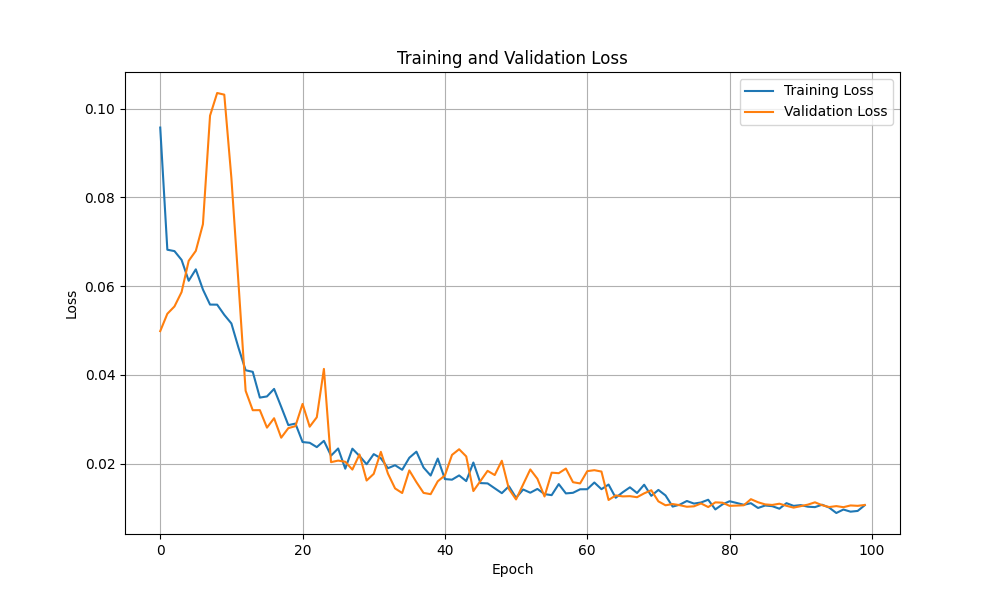
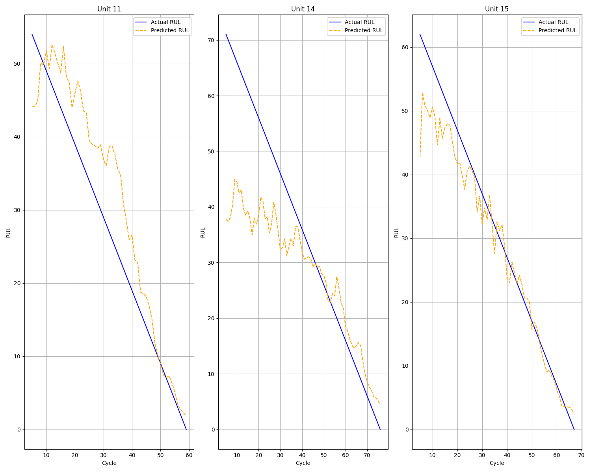

# N-CMAPSS LSTM for Remaining Useful Life (RUL) Prediction

A PyTorch implementation of LSTM neural networks for predicting Remaining Useful Life (RUL) in turbofan engines using the N-CMAPSS (New Commercial Modular Aero-Propulsion System Simulation) dataset.

## Training and Validation Losses

## Predictions on test units
